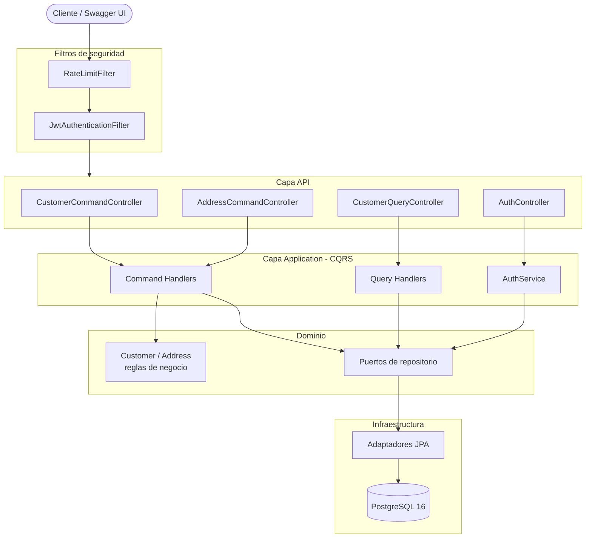

# OrionTek Clients API

API REST para la gestión de **clientes** y sus **direcciones** (relación 1:N), construida
con Java 21 y Spring Boot 3.3. Implementa CQRS con arquitectura hexagonal ligera,
autenticación JWT con control de acceso por roles, rate limiting, paginación, migraciones
versionadas y documentación OpenAPI. Todo el stack se levanta con un solo comando vía Docker
Compose.

---

## Tabla de contenido

- [Stack tecnológico](#stack-tecnológico)
- [Arquitectura](#arquitectura)
- [Cómo levantar el proyecto](#cómo-levantar-el-proyecto)
- [Credenciales demo](#credenciales-demo)
- [Endpoints](#endpoints)
- [Autenticación y roles](#autenticación-y-roles)
- [Reglas de negocio](#reglas-de-negocio)
- [Manejo de errores](#manejo-de-errores)
- [Rate limiting](#rate-limiting)
- [Testing](#testing)
- [Decisiones técnicas y trade-offs](#decisiones-técnicas-y-trade-offs)
- [Mejoras futuras](#mejoras-futuras)

---

## Stack tecnológico

| Área | Tecnología |
|---|---|
| Lenguaje | Java 21 (records, pattern matching, switch expressions) |
| Framework | Spring Boot 3.3 (Web, Data JPA, Security, Validation, Actuator) |
| Base de datos | PostgreSQL 16 |
| Migraciones | Flyway (`V1__init.sql` esquema, `V2__seed.sql` datos demo) |
| Seguridad | Spring Security + JWT (jjwt, HS256) con RBAC |
| Documentación | springdoc-openapi (Swagger UI) |
| Rate limiting | Bucket4j (in-memory) |
| Mapeo | MapStruct |
| Utilidades | Lombok (`@Slf4j`, `@RequiredArgsConstructor`) |
| Tests | JUnit 5, Mockito, Testcontainers, JaCoCo |
| Contenedores | Docker multi-stage + Docker Compose |
| Formato | Spotless (Google Java Format, estilo AOSP) |

## Arquitectura

Se aplica **CQRS pragmático** (Commands y Queries separados) sobre una **arquitectura
hexagonal ligera** (puertos y adaptadores), organizada por *feature* (`auth`, `customer`).

- **Commands** modifican estado, validan reglas de negocio y devuelven solo el ID o `void`.
- **Queries** son de solo lectura (`@Transactional(readOnly = true)`), devuelven DTOs y
  nunca exponen entidades JPA.
- Cada command/query tiene **un único handler** (`CommandHandler<C, R>` / `QueryHandler<Q, R>`).
- El dominio define **puertos** (`CustomerRepository`, `CustomerQueryRepository`) implementados
  por **adaptadores** JPA en la capa de infraestructura.



### Estructura de paquetes

```
com.oriontek.clients
├── config/            SecurityConfig, OpenApiConfig, RateLimitConfig
├── shared/
│   ├── cqrs/          CommandHandler, QueryHandler
│   ├── exception/     GlobalExceptionHandler (RFC 7807), excepciones de dominio
│   ├── security/      JwtService, JwtAuthenticationFilter, RateLimitFilter, UserDetails
│   ├── validation/    Validador de cédula/RNC dominicano
│   └── pagination/    PageResponse<T>
├── auth/              api / application / domain
└── customer/          api / application (command + query) / domain / infrastructure
```

## Cómo levantar el proyecto

### Requisitos

- Docker y Docker Compose.
- (Opcional para desarrollo local) JDK 21 y Maven.

### Con Docker (recomendado)

```bash
cp .env.example .env      # opcional: ajustar credenciales / secreto JWT
docker compose up --build
```

Esto levanta:

- **postgres** — PostgreSQL 16 con healthcheck.
- **app** — la API, que espera a que Postgres esté *healthy* (`depends_on: service_healthy`),
  ejecuta las migraciones Flyway (esquema + seed) y arranca en el puerto `8080`.

> Si el puerto `5432` ya está ocupado por otro Postgres en tu máquina, cambia el puerto del
> host sin tocar nada más: `POSTGRES_PORT=5434 docker compose up --build` (la app se conecta a
> la base por la red interna, así que el mapeo externo es solo para acceso desde el host).

Una vez arriba:

- Swagger UI: <http://localhost:8080/swagger-ui.html>
- OpenAPI JSON: <http://localhost:8080/v3/api-docs>
- Health: <http://localhost:8080/actuator/health>

El health expone el estado de cada componente, incluida la **base de datos**:

```json
{
  "status": "UP",
  "components": {
    "db": { "status": "UP" },
    "diskSpace": { "status": "UP" },
    "livenessState": { "status": "UP" },
    "ping": { "status": "UP" },
    "readinessState": { "status": "UP" }
  },
  "groups": ["liveness", "readiness"]
}
```

Los **detalles internos** de cada componente (motor de base de datos, espacio en disco) solo se
muestran a un usuario autenticado con rol **ADMIN**. El grupo `readiness` incluye la base de datos,
de modo que si Postgres cae, `/actuator/health/readiness` responde `503 DOWN` mientras que
`/actuator/health/liveness` sigue en `200 UP`: la app está viva pero no lista para recibir tráfico.

### Desarrollo local (sin contenedor de la app)

```bash
docker compose up -d postgres
export JWT_SECRET="change-me-in-production-this-is-a-demo-secret-key-min-256-bits-long"
mvn spring-boot:run
```

## Credenciales demo

El seed (`V2__seed.sql`) crea dos usuarios y ~18 clientes dominicanos con 1–4 direcciones.

> **Sobre el perfil `demo`:** los datos de ejemplo se cargan siempre mediante la migración
> `V2__seed.sql`, no dependen del perfil activo. Esto mantiene el entorno reproducible y hace que
> los tests de integración partan siempre del mismo estado. El perfil `demo` únicamente eleva el
> nivel de log de la aplicación a `DEBUG`.

| Rol | Usuario | Contraseña |
|---|---|---|
| ADMIN | `admin` | `Admin123!` |
| USER | `user` | `User123!` |

En Swagger UI usa el botón **Authorize** e introduce el `accessToken` devuelto por
`POST /api/v1/auth/login`.

## Endpoints

### Auth — `/api/v1/auth` (públicos)

| Método | Ruta | Descripción |
|---|---|---|
| POST | `/login` | Devuelve access + refresh token |
| POST | `/register` | Crea un usuario con rol USER |
| POST | `/refresh` | Renueva el access token |

### Customers — `/api/v1/customers`

| Método | Ruta | Rol | Descripción |
|---|---|---|---|
| POST | `/` | ADMIN | Crear cliente con sus direcciones |
| PUT | `/{id}` | ADMIN | Actualizar datos del cliente |
| DELETE | `/{id}` | ADMIN | Soft delete (status INACTIVE) |
| GET | `/` | ADMIN, USER | Listado paginado con filtros y orden |
| GET | `/{id}` | ADMIN, USER | Detalle con todas sus direcciones |

Filtros del listado: `name`, `email`, `city`, `status`; paginación y orden con
`page`, `size`, `sort` (ej. `?page=0&size=10&sort=name,asc&status=ACTIVE`).

### Addresses — `/api/v1/customers/{customerId}/addresses`

| Método | Ruta | Rol | Descripción |
|---|---|---|---|
| POST | `/` | ADMIN | Agregar dirección |
| PUT | `/{addressId}` | ADMIN | Actualizar dirección |
| DELETE | `/{addressId}` | ADMIN | Eliminar dirección (con reglas) |

En [`requests.http`](requests.http) hay una colección lista para ejecutar el flujo completo.

## Autenticación y roles

- **Access token**: 15 minutos. **Refresh token**: 7 días. Firma **HS256**, secreto vía
  variable de entorno `JWT_SECRET`.
- El filtro `JwtAuthenticationFilter` valida el token, verifica que sea de tipo `ACCESS` y
  puebla el `SecurityContext`.
- Autorización por rol con `@PreAuthorize` sobre los controllers.
- Respuestas de seguridad en formato Problem Details: **401** sin token / token inválido,
  **403** con rol insuficiente.

## Reglas de negocio

- Email e `identificationNumber` **únicos** por cliente (409 en conflicto).
- Un cliente debe tener **al menos una dirección** al crearse.
- Solo puede existir **una dirección primaria** por cliente (invariante del agregado y refuerzo
  con índice único parcial en BD).
- No se permite **dejar al cliente sin direcciones** ni **eliminar la dirección primaria sin
  reasignar** otra como primaria.
- **Optimistic locking** (`@Version`) en `Customer` para concurrencia.
- Validación de **cédula (11 dígitos, con dígito verificador) / RNC (9 dígitos)** dominicano.

## Manejo de errores

Respuestas consistentes con **RFC 7807 (`ProblemDetail`)**:

| Situación | Status |
|---|---|
| Validación de campos | 400 |
| No autenticado / token inválido | 401 |
| Rol insuficiente | 403 |
| Recurso no encontrado | 404 |
| Conflicto (email/identificación duplicados, reglas de negocio, concurrencia) | 409 |
| Rate limit excedido | 429 |

## Rate limiting

Implementado con **Bucket4j** (in-memory):

- `POST /api/v1/auth/login`: **10 req/min por IP** (protección contra fuerza bruta).
- Resto de `/api/v1/**`: **100 req/min** por usuario autenticado (o por IP si es anónimo).

Al excederse devuelve **429** con cabecera `Retry-After` y cuerpo Problem Details.

## Testing

```bash
mvn verify
```

- **Unit tests** (JUnit 5 + Mockito): reglas del agregado `Customer` y handlers de commands/queries
  (email duplicado, única dirección primaria, no borrar la última dirección).
- **Integration tests** (Testcontainers con PostgreSQL real): persistencia de clientes con
  direcciones y unicidad de email; flujos end-to-end de login + acceso protegido y de creación de
  cliente con direcciones y consulta de su detalle.
- **JaCoCo** verifica cobertura mínima del 70 % en la capa `application`.

> `mvn verify` requiere un Docker en ejecución (para Testcontainers). En versiones muy recientes
> del Docker Engine puede ser necesario exportar `DOCKER_API_VERSION` a una versión soportada por
> el daemon (ver `docker version`).

## Decisiones técnicas y trade-offs

- **CQRS pragmático sin event sourcing**: separar commands y queries mejora la claridad y permite
  optimizar la lectura (DTOs/proyecciones) sin la complejidad de dos bases de datos ni buses de
  eventos. Se mantiene una sola base de datos transaccional.
- **Arquitectura hexagonal ligera**: el dominio expone puertos y la infraestructura los implementa,
  lo que mantiene la lógica de negocio libre de detalles de persistencia sin sobre-ingeniería.
- **Flyway para esquema y seed**: migraciones versionadas y reproducibles; el seed vive en
  `V2__seed.sql` para que el entorno demo sea determinista.
- **Bucket4j in-memory**: simple y suficiente para una sola instancia; para escalado horizontal se
  migraría a un backend distribuido (ver mejoras futuras).
- **JWT propio (HS256)**: control total y cero dependencias externas para la prueba; en producción
  se valoraría un proveedor de identidad dedicado.
- **MapStruct + records**: mapeo entidad↔DTO sin código repetitivo; los DTOs y commands/queries son
  records inmutables.
- **La dirección primaria** se modela como invariante del agregado `Customer`, reforzada con un
  índice único parcial (`WHERE is_primary`) para garantizar consistencia también a nivel de BD.

## Mejoras futuras

- **Redis** para rate limiting distribuido y blacklist de refresh tokens revocados.
- **Prometheus + Grafana** vía Actuator/Micrometer para métricas.
- **GitHub Actions**: pipeline build → tests → análisis estático → build de imagen.
- **OpenTelemetry** para trazabilidad distribuida.
- **Keycloak** como proveedor de identidad en un escenario real.
