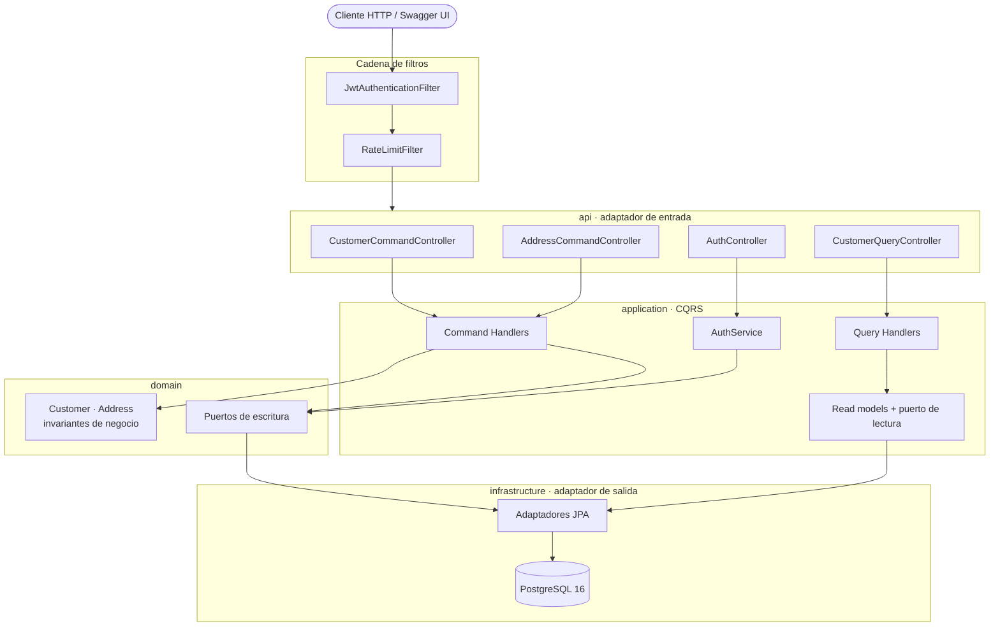

# OrionTek Clients API

API REST para la gestión de **clientes** y sus **direcciones**, donde cada cliente puede tener
N direcciones (relación 1:N).

Construida con **Java 21** y **Spring Boot 3.3**, aplica **CQRS** sobre una **arquitectura
hexagonal ligera**, con autenticación **JWT** y control de acceso por roles, rate limiting,
paginación con filtros, migraciones versionadas y documentación **OpenAPI**. Todo el stack
(aplicación + base de datos) se levanta con un solo comando.

---

## Tabla de contenido

- [Cómo levantar la aplicación](#cómo-levantar-la-aplicación)
  - [Usuarios disponibles](#usuarios-disponibles)
- [Stack tecnológico](#stack-tecnológico)
- [Arquitectura](#arquitectura)
- [Estructura del proyecto](#estructura-del-proyecto)
- [Credenciales demo](#credenciales-demo)
- [Formato de respuesta](#formato-de-respuesta)
- [Endpoints](#endpoints)
- [Ejemplos de peticiones y respuestas](#ejemplos-de-peticiones-y-respuestas)
- [Autenticación y roles](#autenticación-y-roles)
- [Reglas de negocio](#reglas-de-negocio)
- [Manejo de errores](#manejo-de-errores)
- [Rate limiting](#rate-limiting)
- [Health checks](#health-checks)
- [Cómo ejecutar las pruebas](#cómo-ejecutar-las-pruebas)
- [Decisiones técnicas](#decisiones-técnicas)

---

## Cómo levantar la aplicación

### Requisitos

- **Docker** y **Docker Compose**.
- Para desarrollo local, opcionalmente **JDK 21** y **Maven 3.9+**.

### Con Docker

```bash
cp .env.example .env        # opcional: ajustar credenciales y secreto JWT
docker compose up --build
```

El comando levanta dos servicios:

- **postgres** — PostgreSQL 16 con healthcheck y volumen persistente.
- **app** — la API, que espera a que Postgres esté *healthy* (`depends_on: service_healthy`),
  aplica las migraciones Flyway (esquema + datos demo) y queda escuchando en el puerto `8080`.

Una vez arriba, la documentación interactiva de la API queda disponible en **Swagger UI**:

### <http://localhost:8080/swagger-ui.html>

Desde ahí se pueden probar todos los endpoints: autentícate con `POST /api/v1/auth/login`, copia
el `accessToken` de la respuesta y pégalo en el botón **Authorize**.

| Recurso | URL |
|---|---|
| **Swagger UI** | <http://localhost:8080/swagger-ui.html> |
| OpenAPI JSON | <http://localhost:8080/v3/api-docs> |
| Health check | <http://localhost:8080/actuator/health> |

### Usuarios disponibles

La aplicación arranca con dos usuarios ya creados, uno por cada rol:

| Usuario | Contraseña | Rol | Alcance dentro de la aplicación |
|---|---|---|---|
| `admin` | `Admin123!` | **ADMIN** | Acceso total: consultar clientes y además crearlos, actualizarlos, darlos de baja y gestionar sus direcciones |
| `user` | `User123!` | **USER** | Solo lectura: listar clientes con filtros y consultar el detalle con sus direcciones |

Si un usuario con rol `USER` intenta una operación de escritura, la API responde **`403 Forbidden`**.
Los endpoints de autenticación, Swagger UI y el health check son **públicos**, no requieren token.

Puedes registrar usuarios adicionales con `POST /api/v1/auth/register`; se crean siempre con rol
`USER`, de modo que no es posible obtener privilegios de administrador a través de la API.

Para detener el stack:

```bash
docker compose down          # conserva los datos
docker compose down -v       # elimina también el volumen de PostgreSQL
```

> **Puerto 5432 ocupado.** Si ya tienes otro PostgreSQL en tu máquina, cambia únicamente el puerto
> del host: `POSTGRES_PORT=5434 docker compose up --build`. La aplicación se conecta a la base por
> la red interna de Docker, así que el mapeo externo solo afecta al acceso desde tu equipo.

### Desarrollo local

Levanta solo la base de datos en Docker y ejecuta la aplicación desde Maven:

```bash
docker compose up -d postgres
export JWT_SECRET="24a61e89554be20ad9ee8eb5cd47d79be2fb32c6821a23de1700a22c9f216489"
mvn spring-boot:run
```

### Variables de entorno

Todas tienen valores por defecto para desarrollo; se documentan en `.env.example`.

| Variable | Por defecto | Descripción |
|---|---|---|
| `SPRING_PROFILES_ACTIVE` | `demo` | Perfil activo (`dev` o `demo`) |
| `POSTGRES_DB` / `POSTGRES_USER` / `POSTGRES_PASSWORD` | `oriontek` | Credenciales de la base |
| `POSTGRES_PORT` | `5432` | Puerto de PostgreSQL en el host |
| `SERVER_PORT` | `8080` | Puerto de la API |
| `JWT_SECRET` | clave hexadecimal de 64 caracteres | Clave de firma HMAC-SHA512 |
| `JWT_ACCESS_EXPIRATION` | `900` | Vigencia del access token, en segundos |
| `JWT_REFRESH_EXPIRATION` | `604800` | Vigencia del refresh token, en segundos |
| `CORS_ALLOWED_ORIGINS` | `*` | Orígenes permitidos |

## Stack tecnológico

| Área | Tecnología |
|---|---|
| Lenguaje | Java 21 (records, switch expressions, text blocks) |
| Framework | Spring Boot 3.3 (Web, Data JPA, Security, Validation, Actuator) |
| Base de datos | PostgreSQL 16 |
| Migraciones | Flyway (`V1__init.sql` esquema, `V2__seed.sql` datos demo) |
| Seguridad | Spring Security + JWT (jjwt, HMAC-SHA512) con RBAC |
| Documentación | springdoc-openapi (Swagger UI) |
| Rate limiting | Bucket4j |
| Mapeo | MapStruct |
| Utilidades | Lombok (`@Slf4j`, `@RequiredArgsConstructor`) |
| Pruebas | JUnit 5, Mockito, Testcontainers, JaCoCo |
| Contenedores | Docker multi-stage + Docker Compose |
| Formato | Spotless (Google Java Format, estilo AOSP) |

## Arquitectura

**CQRS pragmático** sobre **puertos y adaptadores**, organizado por *feature* (`auth`, `customer`)
en lugar de por capas técnicas.

- Los **Commands** modifican estado, validan las reglas de negocio y devuelven únicamente el ID
  o `void`. Nunca devuelven estado.
- Las **Queries** son de solo lectura (`@Transactional(readOnly = true)`) y devuelven *read models*
  propios; las entidades JPA jamás salen de la capa de infraestructura.
- Cada command y cada query tiene **un único handler**, con los contratos genéricos
  `CommandHandler<C, R>` y `QueryHandler<Q, R>`.

### Regla de dependencias

Las dependencias apuntan siempre hacia adentro: **api → application → domain**. La infraestructura
implementa los puertos y depende de las capas internas, nunca al revés.

- `CustomerRepository` (escritura) vive en `domain` porque opera sobre el agregado.
- `CustomerQueryRepository` (lectura) vive en `application/query` porque devuelve read models, que
  son un concepto de la capa de aplicación.



## Estructura del proyecto

```
src/main/java/com/oriontek/clients
├── OrionTekApplication.java
├── config/                          SecurityConfig, OpenApiConfig, OpenApiResponsesCustomizer
├── shared/
│   ├── cqrs/                        CommandHandler, QueryHandler
│   ├── exception/                   DomainException y sus especializaciones
│   ├── pagination/                  PageResponse<T>, PaginationMeta
│   ├── ratelimit/                   RateLimitFilter, RateLimitProperties, RateLimitConfig
│   ├── security/                    JwtService, JwtAuthenticationFilter, JpaUserDetailsService,
│   │                                SecurityProblemDetailHandler, JwtProperties, TokenType
│   ├── validation/                  Validador de cédula/RNC dominicano
│   └── web/                         ApiResponse, ApiError, GlobalExceptionHandler
├── auth/
│   ├── api/                         AuthController, AuthApiMapper, dto/
│   ├── application/                 AuthService, AuthTokens
│   ├── domain/                      User, Role, UserRepository (puerto)
│   └── infrastructure/persistence/  UserJpaRepository, UserRepositoryAdapter
└── customer/
    ├── api/                         CustomerCommandController, CustomerQueryController,
    │                                AddressCommandController, CustomerApiMapper, dto/
    ├── application/
    │   ├── CustomerViewMapper.java
    │   ├── command/                 Comandos + sus handlers
    │   └── query/                   Queries + handlers + read models + puerto de lectura
    ├── domain/                      Customer, Address, enums, CustomerRepository (puerto)
    └── infrastructure/persistence/  CustomerJpaRepository, CustomerRepositoryAdapter,
                                     CustomerSpecifications
```

Los DTOs siguen un recorrido explícito por capa, lo que hace evidente dónde está cada objeto:

```
AddressRequest (api)  →  AddressInput (command)  →  Address (domain)  →  AddressView (query)
```

```
src/test/java/com/oriontek/clients
├── support/                         AbstractIntegrationTest (contenedor PostgreSQL compartido)
├── e2e/                             AuthAndCustomerFlowIntegrationTest
└── customer/
    ├── domain/                      CustomerTest (invariantes del agregado)
    ├── application/command/          Un test por handler + PrimaryAddressReassignmentIntegrationTest
    ├── application/query/            GetCustomerByIdHandlerTest
    └── infrastructure/persistence/   CustomerRepositoryIntegrationTest
```

> **Clave de firma.** El repositorio incluye una clave hexadecimal de 64 caracteres para que el
> proyecto arranque sin configuración previa. Al desplegar, genera una propia y pásala por entorno:
>
> ```bash
> openssl rand -hex 32
> ```
>
> Los tokens se firman con HMAC-SHA512, que requiere una clave de al menos 512 bits: los 64
> caracteres hexadecimales cumplen ese mínimo.

## Credenciales demo

El seed (`V2__seed.sql`) crea los dos usuarios descritos en
[Usuarios disponibles](#usuarios-disponibles) junto con 18 clientes dominicanos, cada uno con
entre 1 y 4 direcciones repartidas por Santo Domingo, Santiago, La Romana y otras provincias.

> Los datos de ejemplo se cargan siempre mediante la migración `V2__seed.sql`, sin depender del
> perfil activo, de modo que el entorno sea reproducible. El perfil `demo` únicamente eleva el
> nivel de log a `DEBUG`.

## Formato de respuesta

Todos los endpoints devuelven la **misma envoltura**, de modo que un cliente puede tratar
cualquier respuesta de forma uniforme.

**Éxito**

```json
{
  "successful": true,
  "data": { }
}
```

**Éxito en un listado** — `data` contiene los elementos y `pagination` los metadatos:

```json
{
  "successful": true,
  "data": [ ],
  "pagination": {
    "page": 0,
    "size": 20,
    "totalElements": 34,
    "totalPages": 2,
    "first": true,
    "last": false
  }
}
```

**Error**

```json
{
  "successful": false,
  "error": {
    "status": 409,
    "title": "Conflicto con el estado actual",
    "detail": "No se puede eliminar la dirección primaria sin reasignar otra como primaria",
    "type": "https://oriontek.com/problems/409",
    "timestamp": "2026-07-23T22:00:00Z"
  }
}
```

Los campos `pagination` y `error` **se omiten** cuando no aplican, en lugar de viajar como `null`.
En los errores de validación, `error.errors` añade el detalle campo por campo. El objeto `error`
conserva los campos de **RFC 7807** (`status`, `title`, `detail`, `type`), de modo que no se pierde
esa información al usar la envoltura.

Como el contrato es uniforme, las operaciones de actualización y borrado responden **`200`** con
`{"successful": true}` en lugar de un `204` sin cuerpo.

## Endpoints

> Todos los endpoints se pueden explorar y ejecutar desde **Swagger UI**:
> **<http://localhost:8080/swagger-ui.html>** (definición OpenAPI en
> <http://localhost:8080/v3/api-docs>). Usa el botón **Authorize** para enviar el token JWT.

### Auth — `/api/v1/auth` (públicos)

| Método | Ruta | Éxito | Descripción |
|---|---|---|---|
| POST | `/login` | `200` | Devuelve access token y refresh token |
| POST | `/register` | `201` | Crea un usuario con rol USER y devuelve sus tokens |
| POST | `/refresh` | `200` | Renueva el access token a partir del refresh token |

### Customers — `/api/v1/customers`

| Método | Ruta | Rol | Éxito | Descripción |
|---|---|---|---|---|
| POST | `/` | ADMIN | `201` | Crear cliente junto con sus direcciones |
| PUT | `/{id}` | ADMIN | `200` | Actualizar los datos del cliente |
| DELETE | `/{id}` | ADMIN | `200` | Baja lógica (pasa a `INACTIVE`) |
| GET | `/` | ADMIN, USER | `200` | Listado paginado con filtros y ordenamiento |
| GET | `/{id}` | ADMIN, USER | `200` | Detalle con todas sus direcciones |

Filtros disponibles en el listado: `name`, `email`, `city` y `status`. Paginación y orden con
`page`, `size` y `sort`:

```
GET /api/v1/customers?page=0&size=10&sort=name,asc&city=Santiago&status=ACTIVE
```

Los elementos viajan en `data` y los metadatos en `pagination` (`page`, `size`, `totalElements`,
`totalPages`, `first` y `last`), según el [formato de respuesta](#formato-de-respuesta) común.

### Addresses — `/api/v1/customers/{customerId}/addresses`

| Método | Ruta | Rol | Éxito | Descripción |
|---|---|---|---|---|
| POST | `/` | ADMIN | `201` | Agregar una dirección al cliente |
| PUT | `/{addressId}` | ADMIN | `200` | Actualizar una dirección |
| DELETE | `/{addressId}` | ADMIN | `200` | Eliminar una dirección, respetando las reglas de negocio |

En [`requests.http`](requests.http) hay una colección lista para ejecutar el flujo completo.

## Ejemplos de peticiones y respuestas

Las respuestas siguientes son salidas reales de la aplicación (los tokens aparecen recortados).

### Autenticación

```http
POST /api/v1/auth/login
Content-Type: application/json

{ "username": "admin", "password": "Admin123!" }
```

**`200 OK`**

```json
{
  "successful": true,
  "data": {
    "accessToken": "eyJhbGciOiJIUzUxMiJ9.eyJpc3MiOiJ…",
    "refreshToken": "eyJhbGciOiJIUzUxMiJ9.eyJpc3MiOiJ…",
    "tokenType": "Bearer",
    "expiresIn": 900
  }
}
```


### Registro de un usuario

```http
POST /api/v1/auth/register
Content-Type: application/json

{
  "username": "nuevo.usuario",
  "email": "nuevo.usuario@oriontek.com",
  "password": "Password123"
}
```

**`201 Created`** — el usuario se crea siempre con rol `USER` y la respuesta ya incluye sus tokens,
de modo que no hace falta un login posterior.

```json
{
  "successful": true,
  "data": {
    "accessToken": "eyJhbGciOiJIUzUxMiJ9.eyJpc3MiOiJ…",
    "refreshToken": "eyJhbGciOiJIUzUxMiJ9.eyJpc3MiOiJ…",
    "tokenType": "Bearer",
    "expiresIn": 900
  }
}
```

Si el nombre de usuario o el email ya existen, la respuesta es **`409 Conflict`**:

```json
{
  "successful": false,
  "error": {
    "status": 409,
    "title": "Conflicto con el estado actual",
    "detail": "El nombre de usuario ya está en uso: doc5558000",
    "type": "https://oriontek.com/problems/409",
    "timestamp": "2026-07-24T00:28:08.949059050Z"
  }
}
```

### Listado paginado de clientes

```http
GET /api/v1/customers?page=0&size=2&sort=name,asc
Authorization: Bearer <access token>
```

**`200 OK`** — los clientes van en `data`, los metadatos en `pagination`, y cada elemento incluye
el número de direcciones asociadas.

```json
{
  "successful": true,
  "data": [
    {
      "id": "a0000000-0000-0000-0000-000000000006",
      "name": "Ana Cristina Reyes",
      "email": "ana.reyes@example.com",
      "phone": "829-555-0106",
      "identificationNumber": "00667890123",
      "status": "ACTIVE",
      "addressCount": 1,
      "createdAt": "2026-07-23T20:14:21.188920Z",
      "updatedAt": "2026-07-23T20:14:21.188920Z"
    }
  ],
  "pagination": {
    "page": 0,
    "size": 2,
    "totalElements": 36,
    "totalPages": 18,
    "first": true,
    "last": false
  }
}
```


### Detalle de un cliente

```http
GET /api/v1/customers/{id}
Authorization: Bearer <access token>
```

**`200 OK`** — incluye todas sus direcciones, con una sola marcada como primaria.

```json
{
  "successful": true,
  "data": {
    "id": "a0000000-0000-0000-0000-000000000003",
    "name": "Pedro Antonio Martínez",
    "email": "pedro.martinez@example.com",
    "phone": "849-555-0103",
    "identificationNumber": "00334567890",
    "status": "ACTIVE",
    "addresses": [
      {
        "id": "ca552aa7-9e5e-4a11-998a-d029a1845f57",
        "street": "Av. Luperón 88",
        "city": "Santo Domingo",
        "state": "Distrito Nacional",
        "country": "República Dominicana",
        "postalCode": "10514",
        "type": "HOME",
        "primary": true
      }
    ],
    "createdAt": "2026-07-23T20:14:21.188920Z",
    "updatedAt": "2026-07-23T20:14:21.188920Z"
  }
}
```


### Crear un cliente con sus direcciones

```http
POST /api/v1/customers
Authorization: Bearer <access token>
Content-Type: application/json

{
  "name": "Cliente de Ejemplo",
  "email": "cliente.ejemplo@correo.com",
  "phone": "809-555-9999",
  "identificationNumber": "40200123459",
  "addresses": [
    {
      "street": "Av. Principal 100",
      "city": "Santo Domingo",
      "state": "Distrito Nacional",
      "postalCode": "10101",
      "type": "HOME",
      "primary": true
    }
  ]
}
```

**`201 Created`** con la cabecera `Location: /api/v1/customers/{id}`. Siguiendo CQRS, el comando
devuelve únicamente el identificador del recurso creado:

```json
{
  "id": "b5139974-eb24-4365-b26f-9a732b6c361d"
}
```

### Agregar una dirección

```http
POST /api/v1/customers/{customerId}/addresses
Authorization: Bearer <access token>
Content-Type: application/json

{
  "street": "Calle Secundaria 5",
  "city": "Santiago",
  "state": "Santiago",
  "postalCode": "51000",
  "type": "WORK",
  "primary": false
}
```

**`201 Created`**

```json
{
  "id": "8539c038-8237-4d5a-8a69-b006bade026f"
}
```

Si se omite `country`, se aplica por defecto `"República Dominicana"`.

### Actualizar y eliminar

`PUT /api/v1/customers/{id}`, `PUT` y `DELETE` sobre direcciones y la baja lógica del cliente
responden **`204 No Content`** sin cuerpo.

### Respuesta ante una regla de negocio

Al intentar eliminar la dirección primaria de un cliente sin haber designado otra:

```http
DELETE /api/v1/customers/{customerId}/addresses/{addressId}
Authorization: Bearer <access token>
```

**`409 Conflict`**

```json
{
  "type": "https://oriontek.com/problems/409",
  "title": "Conflicto con el estado actual",
  "status": 409,
  "detail": "No se puede eliminar la dirección primaria sin reasignar otra como primaria",
  "instance": "/api/v1/customers/b5139974-eb24-4365-b26f-9a732b6c361d/addresses/d372c38a-08e1-4ebb-b1fe-f337375d5b4c",
  "timestamp": "2026-07-23T23:35:05.446415882Z"
}
```

## Autenticación y roles

- **Access token** de 15 minutos y **refresh token** de 7 días, firmados con **HMAC-SHA512** usando el
  secreto de la variable `JWT_SECRET`.
- `JwtAuthenticationFilter` valida la firma, comprueba que el token sea de tipo `ACCESS` y puebla
  el `SecurityContext`.
- La autorización se aplica en **dos niveles**: por ruta y método HTTP en la cadena de filtros, y
  con `@PreAuthorize` en los controllers. Así un rol insuficiente recibe `403` antes de que se
  valide el cuerpo de la petición.
- `POST /api/v1/auth/register` siempre crea usuarios con rol `USER`; no es posible escalar
  privilegios a través de la API.

| Recurso | Público | USER | ADMIN |
|---|:--:|:--:|:--:|
| `/api/v1/auth/**` | ✅ | ✅ | ✅ |
| `/actuator/health`, Swagger UI, OpenAPI | ✅ | ✅ | ✅ |
| `GET /api/v1/customers/**` | ❌ | ✅ | ✅ |
| `POST`, `PUT`, `DELETE` sobre `/api/v1/customers/**` | ❌ | ❌ | ✅ |

## Reglas de negocio

- `email` e `identificationNumber` son **únicos** entre clientes.
- Un cliente debe tener **al menos una dirección** al crearse.
- Solo puede existir **una dirección primaria** por cliente. Al marcar otra como primaria, la
  anterior se degrada automáticamente.
- No se permite **dejar al cliente sin direcciones** ni **eliminar la dirección primaria** sin
  designar antes otra como primaria.
- La baja de un cliente es **lógica**: pasa a `INACTIVE` y sigue siendo consultable.
- Validación de **cédula dominicana** (11 dígitos con dígito verificador) y **RNC** (9 dígitos).
- **Optimistic locking** con `@Version` en `Customer` para el control de concurrencia.

La invariante de dirección primaria se refuerza además en la base de datos con un índice único
parcial (`WHERE is_primary = TRUE`).

## Manejo de errores

Todas las respuestas de error siguen **RFC 7807 (`ProblemDetail`)**:

| Situación | Status |
|---|---|
| Error de validación de campos | 400 |
| No autenticado o token inválido | 401 |
| Rol insuficiente | 403 |
| Recurso no encontrado | 404 |
| Conflicto: duplicados, reglas de negocio o concurrencia | 409 |
| Límite de solicitudes excedido | 429 |

Los errores de validación incluyen el detalle campo por campo:

```json
{
  "successful": false,
  "error": {
    "status": 400,
    "title": "Error de validación",
    "detail": "Uno o más campos son inválidos",
    "type": "https://oriontek.com/problems/400",
    "errors": [
      {
        "field": "email",
        "message": "must be a well-formed email address"
      },
      {
        "field": "identificationNumber",
        "message": "Identificación inválida: debe ser una cédula (11 dígitos) o RNC (9 dígitos) válido"
      },
      {
        "field": "name",
        "message": "size must be between 2 and 100"
      },
      {
        "field": "addresses",
        "message": "must not be empty"
      }
    ],
    "timestamp": "2026-07-24T00:00:36.805815382Z"
  }
}
```

## Rate limiting

Implementado con **Bucket4j**:

- `POST /api/v1/auth/login`: **10 solicitudes por minuto y por IP**, como protección frente a
  ataques de fuerza bruta.
- Resto de `/api/v1/**`: **100 solicitudes por minuto** por usuario autenticado, o por IP si la
  petición es anónima.

Al superar el límite, la API responde **429** con la cabecera `Retry-After` y un cuerpo Problem
Details. Mientras queda cupo, cada respuesta incluye la cabecera `X-Rate-Limit-Remaining`.

## Health checks

`GET /actuator/health` informa del estado de cada componente, incluida la base de datos:

```json
{
  "status": "UP",
  "components": {
    "db": { "status": "UP" },
    "diskSpace": { "status": "UP" },
    "livenessState": { "status": "UP" },
    "ping": { "status": "UP" },
    "readinessState": { "status": "UP" }
  },
  "groups": ["liveness", "readiness"]
}
```

Los **detalles internos** de cada componente (motor de base de datos, espacio en disco) solo se
muestran a usuarios autenticados con rol **ADMIN**.

El grupo `readiness` incluye la base de datos: si PostgreSQL cae,
`GET /actuator/health/readiness` responde `503 DOWN` mientras que
`GET /actuator/health/liveness` sigue en `200 UP`. La aplicación está viva pero no lista para
recibir tráfico, que es justo lo que un orquestador necesita para dejar de enrutarle peticiones
sin reiniciar el contenedor.

## Cómo ejecutar las pruebas

```bash
mvn verify
```

Ejecuta la suite completa (**30 pruebas**), genera el informe de cobertura y valida el umbral
mínimo. Los tests de integración levantan un PostgreSQL real con Testcontainers, por lo que
**necesitas Docker en ejecución**.

Otros comandos útiles:

```bash
mvn test                                      # solo la fase de pruebas
mvn test -Dtest=CustomerTest                  # una clase concreta
mvn test -Dtest='*IntegrationTest'            # solo las pruebas de integración
mvn spotless:apply                            # aplicar el formato del proyecto
```

### Qué cubre cada nivel

| Nivel | Alcance |
|---|---|
| **Unitarias** (JUnit 5 + Mockito) | Invariantes del agregado `Customer` (dirección primaria única, no quedarse sin direcciones) y cada handler de command/query por separado: duplicados de email e identificación, cliente inexistente, baja lógica |
| **Integración** (Testcontainers) | Persistencia del agregado con sus direcciones, restricciones de unicidad y reasignación de la dirección primaria contra un PostgreSQL real |
| **End to end** (`TestRestTemplate`) | Login y acceso a un endpoint protegido, rechazo sin token y alta de un cliente con direcciones seguida de la consulta de su detalle |

La cobertura se mide con **JaCoCo**, que exige un mínimo del **70 % de líneas en la capa
`application`**. El informe HTML queda en `target/site/jacoco/index.html`.

> En versiones muy recientes del Docker Engine, el cliente que usa Testcontainers puede necesitar
> que se fije la versión de la API. El proyecto ya lo hace mediante la propiedad
> `docker.api.version` del `pom.xml`, que puedes sobrescribir con
> `mvn verify -Ddocker.api.version=1.44` si tu daemon requiere otra.

### Probar la API manualmente

Con el stack levantado:

```bash
# 1. Obtener un token
TOKEN=$(curl -s -X POST http://localhost:8080/api/v1/auth/login \
  -H 'Content-Type: application/json' \
  -d '{"username":"admin","password":"Admin123!"}' | jq -r .accessToken)

# 2. Listar clientes
curl -s -H "Authorization: Bearer $TOKEN" \
  "http://localhost:8080/api/v1/customers?page=0&size=5&sort=name,asc" | jq

# 3. Crear un cliente con sus direcciones
curl -s -X POST http://localhost:8080/api/v1/customers \
  -H "Authorization: Bearer $TOKEN" -H 'Content-Type: application/json' \
  -d '{
        "name": "Cliente de Ejemplo",
        "email": "cliente.ejemplo@correo.com",
        "phone": "809-555-9999",
        "identificationNumber": "40200123459",
        "addresses": [
          { "street": "Av. Principal 100", "city": "Santo Domingo",
            "state": "Distrito Nacional", "type": "HOME", "primary": true }
        ]
      }' | jq
```

## Decisiones técnicas

- **CQRS sin event sourcing.** Separar commands y queries aclara el código y permite optimizar la
  lectura con read models propios, sin la complejidad de dos bases de datos ni buses de eventos.
  Se mantiene una única base transaccional.
- **Arquitectura hexagonal ligera.** El dominio define puertos y la infraestructura los implementa,
  manteniendo las reglas de negocio libres de detalles de persistencia sin caer en sobre-ingeniería.
- **Read models propios para las queries.** Evitan exponer entidades JPA y permiten resolver el
  listado con un número constante de consultas: el conteo de direcciones se obtiene con una única
  consulta agregada en lugar de una por cliente.
- **Flyway para esquema y datos.** Migraciones versionadas y reproducibles; el seed vive en
  `V2__seed.sql` para que el entorno demo sea determinista y los tests partan siempre del mismo
  estado.
- **La dirección primaria como invariante del agregado.** La regla se aplica en `Customer` y se
  refuerza con un índice único parcial en la base de datos. Al reasignarla, la degradación de la
  anterior se persiste antes de insertar la nueva, evitando que ambas coexistan durante el *flush*.
- **JWT propio con HMAC-SHA512.** Control total y sin dependencias externas para el alcance de esta
  prueba, con el secreto siempre fuera del código.
- **Autorización en dos niveles.** Los matchers por ruta se evalúan antes que la validación del
  cuerpo, de modo que un rol insuficiente nunca recibe pistas sobre el formato esperado.
- **Bucket4j en memoria.** Suficiente y sin dependencias adicionales para una sola instancia, que
  es el escenario de esta entrega.
- **MapStruct y records.** El mapeo entre capas es declarativo y no hay código repetitivo escrito a
  mano; DTOs, comandos, queries y read models son records inmutables.
